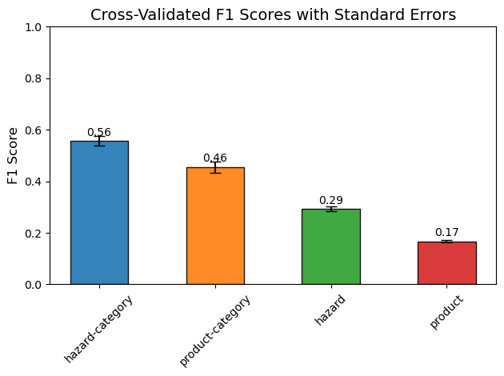
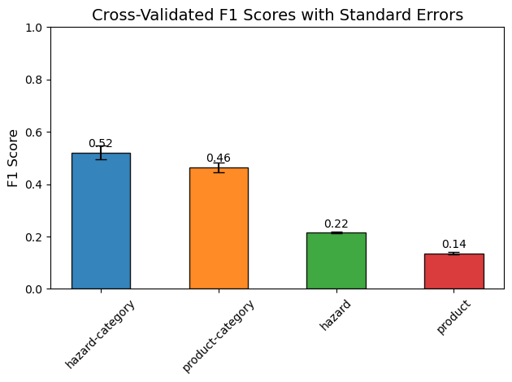
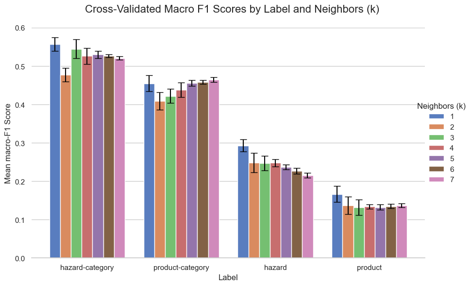
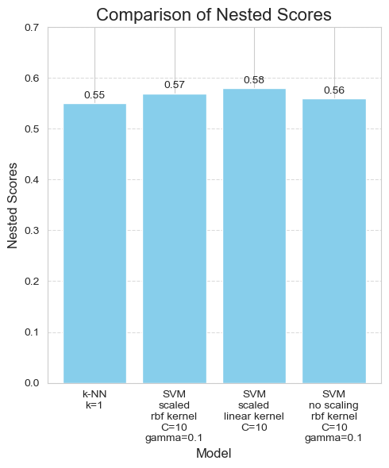
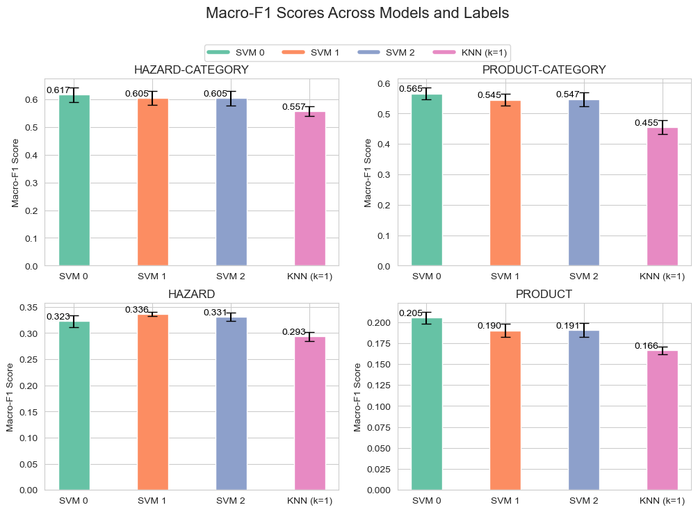
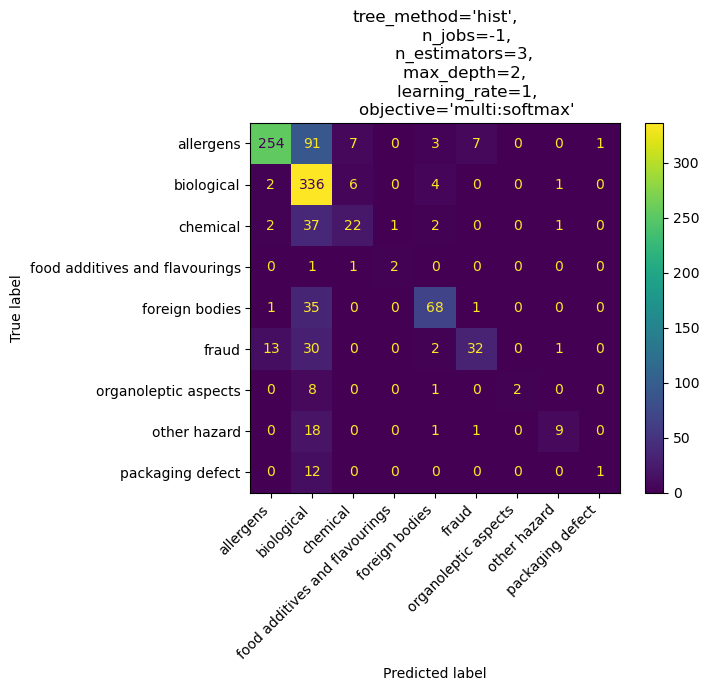
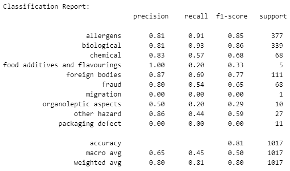
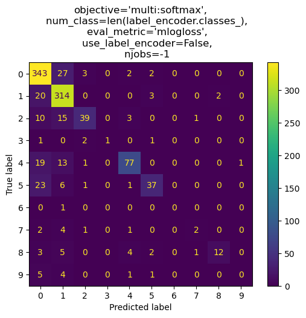
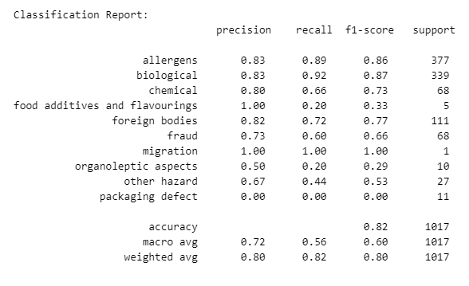
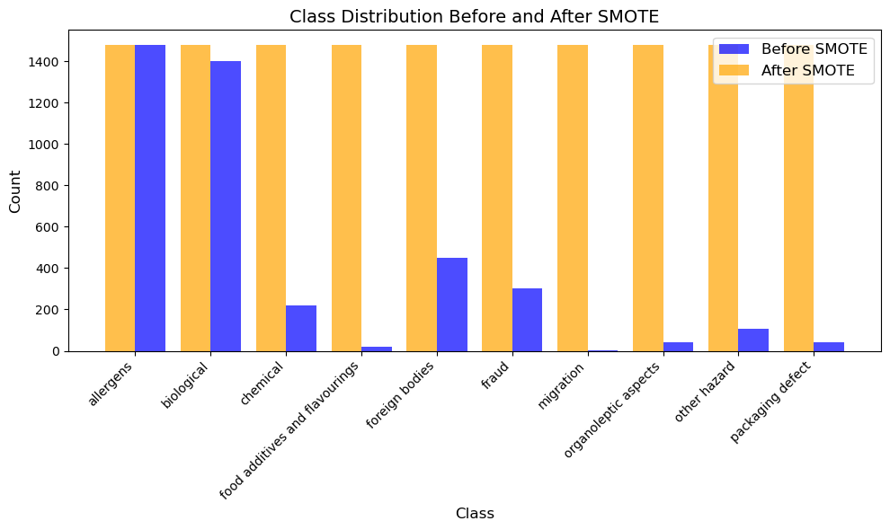

# PDS-A2: food-hazard-detection

**Course**: Practical Data Science - MSc in Data Science

**Title**: A2 Assignment - SemEval Food Hazard Detection Challenge

**Student**: Christos Katrinakis

## Description
1. Participate in the [Food Hazard Detection Challenge](https://food-hazard-detection-semeval-2025.github.io/) by downloading and exploring the data. 
2. Perform two benchmark analyses using both basic and advanced ML algorithms, and evaluate your experimental results. 
    - One benchmark should focus on the **short texts** (titles) provided
    - and the other on the **long texts**.

4. Based on your findings, determine the best-performing system, and submit your predictions along with the score and rank received on the leaderboard.

Your solution should be hosted in a GitHub repository, which must include:
- A README file detailing your results and other important information.
- All code files required to run your solution, and making it easy to re-run by following the provided guidelines in the README.

Submit the link to your GitHub project. Ensure that version control is used throughout your work, allowing us to review your progress.

## Benchmark `title`

**Mean F1 score over 5-fold Monte Carlo CV**

| Model | `hazard-category` | `product-category` | `hazard` | `product` |
| ---: | ---: | ---: | ---: | ---: |
| MAJORITY | 0.059  | 0.022 | 0.002 | 0.0 |
| RANDOM | 0.063 | 0.031 | 0.004 | 0.0 |
| TF-IDF-$k$=1-NN | 0.557 | 0.455 | 0.293 | 0.166 |
| TF-IDF-SVM$^*$ | 0.617 | 0.565 | 0.323 | 0.205 |
| TF-IDF-XGBOOST | ---: | ---: | ---: | ---: |

$^*$ SVM C=10, gamma=0.1 and rbf kernel


## Results
Achieved in the competition (ST1):
**Rank**: 30th,  
**Score**: 0.6441
using an SVM algorithm

## Data description

The data consists of 10 columns:

**Features**
- ***title***: Short text. The title of a food incident report, collected from the internet
- ***text***: Long text. The text contents of the recall.

**Labels**
- ***hazard-category***: used for (ST1)
- ***product-category***: used for (ST1)
- ***hazard***: used for (ST2)
- ***product***: used for (ST2)

## Preprocessing

* Preprocessing could perhaps help improve the quality of the vectorization, (for which we chose TF-IDF), especially through lemmatization, and enhance the performance of the classifiers.
* Experiments conducted with the lemmatized version of the `title` feature did not show any improvement (for various combinations of SVM parameters and scaling, with n-gram range -stupidely- set to (2,5) at the time).
* To the contrary **they showed a slight decrease**, consistent across all experiments.
* **Conclusion**: We decide to **not use any preprocessing** on the data. 
* The steps taken are available in the notebook under section Preprocessing.
* If you want to use the lemmatized text and don't want to rerun the process, skip to the last cell of this section.

## Setup
To test an algorithm on one train-test split can be misleading, as the 

## Title classification

### 1. k-NN

k=1


k=7


k-NN for $k \in \{1,2,...,7\}$

* First of all, we notice $k=1$ generally does better than the rest.

* Especially in the `hazard` and `product` labels, where the score decreases as $k$ increases. That is normal considering the severe class imbalance. For categories with as little as one example, $k>1$ will result in bias towards majority classes, decreasing the macro-$F_1$ score.

* For `hazard-category` though, $k=3$ might be just as good, as it has about the same mean and standard error.

* For `product-category`, it is surprising that $k=7$ is an exception to the rule: not only does it do better than $k=1$, but also it has less $\operatorname{s.e.}$

* But $k=1$ is an "iffy" choice because it is susceptible to minor changes in the data. In other words, overfitting.

### 2. Support Vector Machines

SVMs, though a basic classifier, have been proven to often outperform far more complicated classifiers, with the right hyperparameter tuning. So they are a justified choice for our second model. From the non-parametric k-NN, we will go to the basic but powerful SVMs and perform some hyperparameter tuning.

SVM classification tries to seperate two classes with a hyperplane in some transformed feature space. It tries to find the hyperplane that leaves maximum margin from both classes, i.e. that leaves the same distance from the nearest points.(support vectors) from each class.

#### Hyperparameter tuning.

We conducted the following experiment to try and find the best parameter combination for the SVM, specifically for `title` and `hazard-category`.

1. Preprocessing
    1. Vectorize text using TF-IDF
    2. **Scale** the TF-IDF matrix to standardize feature values (SVMs are NOT scale invariant).
2. Hyperparameter tuning
    1. Use **cross-validation** to tune:
        * C: regularization strength
        * kernel: (e.g. linear, rbf)
        * gamma: (for non linear kernels)
    2. Test with **class-weight**=balanced and without
    3. Evaluate metrics like precision, recall and F1-score, especially for minority classes.

After a long long time, we got the following results:

**Output**:
Fitting 3 folds for each of 264 candidates, totalling 792 fits
Fitting 3 folds for each of 264 candidates, totalling 792 fits
Fitting 3 folds for each of 264 candidates, totalling 792 fits
Nested CV F1 Scores: [0.5651030818941731, 0.5804198946263113, 0.5499154337967773]
Mean Nested CV F1 Score: 0.5651
Outer Fold 1: Best Parameters: {'scaler': None, 'svm__C': 10, 'svm__class_weight': None, 'svm__gamma': 0.1, 'svm__kernel': 'rbf'}
Outer Fold 2: Best Parameters: {'scaler': MaxAbsScaler(), 'svm__C': 1, 'svm__class_weight': None, 'svm__kernel': 'linear'}
Outer Fold 3: Best Parameters: {'scaler': MaxAbsScaler(), 'svm__C': 10, 'svm__class_weight': None, 'svm__gamma': 0.1, 'svm__kernel': 'rbf'}

One thing all folds agree on is `class_weight=None`, which is surprising, since `'balanced'` forces the model to pay attention to minority classes, and *should* lead to an improved macro F1 score. 

Another is `gamma=0.1`, for `rbf` kernels. 

In two cases out of three:
* the `MaxAbsScaler()` does better, but for different kernels
* C = 10, but with different kernels
* `kernel='rbf'`, but with different scalings.

Conclusion:
* `C=10` does well with rbf kernels, while `C=1` with linear kernels
* `MaxAbsScaler()` helps the linear kernel(?), but not necessarily the rbf kernel.
* `class_weight` should remain `None` 
* `gamma` is set to 0.1 for rbf kernels

For `HAZARD-CATEGORY`:


#### SVMs vs k-NN, k=1


So SVMs were an improvement. 
* For ST1 labels, SVM 0 (unscaled, C=10, gamma=0.1 and rbf kernel) definitely does better, although the difference from the other SVMs is small.
* In `HAZARD`, SVMs do better than the kNN. SVM 1 in particular (linear kernel and C=1 with MaxAbsScaler) has less error and greater mean compared to the other two. 
* But it is in `PRODUCT` that our SVMs make us proud! A 20% improvement from the kNN, $k=1$

### 3. XGBoost

Initializing an instance to gauge how it goes:
```
clf = XGBClassifier(tree_method='hist',
                    n_jobs=-1,
                    n_estimators=3, 
                    max_depth=2, 
                    learning_rate=1, 
                    objective='multi:softmax',
                )
```
Confusion matrix



Classification report

|  | precision | recall | f1-score | support |
| ---: | ---: | ---: | ---: | ---: |
| allergens | 0.93 | 0.70 | 0.80 | 363 |
| biological | 0.59 | 0.96 | 0.73 | 349 |
| chemical | 0.61 | 0.34 | 0.44 | 65 |
| food additives and flavourings | 0.67 | 0.50 | 0.57 | 4 |
| foreign bodies | 0.84 | 0.65 | 0.73 | 105 |
| fraud | 0.78 | 0.41 | 0.54 | 78 |
| organoleptic aspects | 1.00 | 0.18 | 0.31 | 11 |
| other hazard | 0.75 | 0.31 | 0.44 | 29 |
| packaging defect | 0.50 | 0.08 | 0.13 | 13 |
| accuracy |  |  | 0.71  | 1017 |
| macro avg | 0.74 | 0.46 | 0.52 | 1017 |
| weighted avg | 0.76 | 0.71 | 0.70 | 1017 |

Let's try another model with a bit different parameters:
```
model = xgb.XGBClassifier(
    objective='multi:softmax',  # For multi-class classification
    num_class=len(label_encoder.classes_),
    eval_metric='mlogloss',
    use_label_encoder=False,
    njobs=-1
)
```

Accuracy: 0.8112094395280236



Confusion matrix



The second model achieved higher accuracy (0.81 vs 0.71) but lower macro F1 score: 0.50 vs 0.52.

But this is just an observation, as infering which model does better we would need to measure the performance of both using cross validation over multiple folds.

#### Using SMOTE to handle class imbalance (oversamlping)

**SMOTE** (Synthetic Minority Oversampling Technique) is a method used to address class imbalance by **generating synthetic examples for the minority class**. The motivation for using SMOTE is to improve model performance on imbalanced datasets by providing the model with more balanced training data, which helps it learn the characteristics of underrepresented classes effectively.

Accuracy: 0.816125860373648



#### Class Distribution with SMOTE (training set)

We can see how SMOTE made the training set balanced, even for classes with one example.



But did it improve performance? Yes! The macro average jumped to 0.60!
